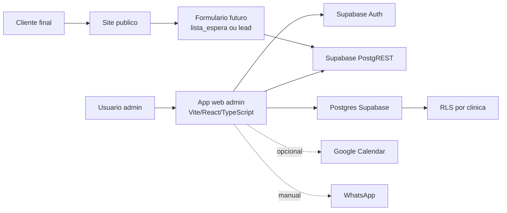

# Arquitetura do Sistema

## Visao geral

O sistema esta em transicao entre um painel legado em Google Apps Script e uma futura aplicacao web baseada em Supabase.

Hoje existem tres blocos:

1. Site publico estatico.
2. Painel administrativo legado em Google Apps Script.
3. Backend Supabase modelado, limpo e pronto para ser usado pela nova aplicacao.

## Componentes existentes

### Site publico

Arquivos:

- `index.html`
- `styles.css`
- `script.js`
- `assets/hero-estetica.avif`, `assets/hero-estetica.webp` e fallback `assets/hero-estetica.png`

Responsabilidades:

- Apresentar a marca Thais Schneider Estetica.
- Listar servicos em formato institucional.
- Direcionar para Instagram.
- Direcionar para `admin.html`.

Limitacoes:

- Nao grava dados no Supabase.
- Nao possui formulario de agendamento.
- Nao possui autenticacao.

### Pagina administrativa local

Arquivo:

- `admin.html`

Responsabilidades:

- Mostrar uma pagina de acesso administrativo.
- Embutir o Web App do Google Apps Script em `iframe`.

Limitacoes:

- Depende de URL publicada do Apps Script.
- Nao usa Supabase.
- Nao e a arquitetura final recomendada.

### Painel Apps Script legado

Arquivos:

- `apps-script/Code.gs`
- `apps-script/Index.html`
- `apps-script/Client.html`
- `apps-script/Styles.html`
- `apps-script/appsscript.json`

Responsabilidades:

- CRUD de clientes.
- CRUD de servicos e precos.
- CRUD de agendamentos.
- Sincronizacao com Google Calendar.
- Geracao de mensagens manuais para WhatsApp.
- Campanhas.
- Financeiro agregado.
- Controle de acesso por e-mail Google.

Dependencias:

- Google Apps Script.
- Google Sheets.
- Google Calendar.
- Sessao Google.

### Supabase

Projeto:

- Nome: `estetica_schneider`
- Ref: `xucttzuthznqwlhushmg`
- URL: `https://xucttzuthznqwlhushmg.supabase.co`
- Regiao: `sa-east-1`
- Postgres: `17`

Responsabilidades previstas:

- Banco transacional.
- Autenticacao.
- RLS multi-clinica.
- API PostgREST.
- Tipos TypeScript gerados.

Estado:

- Banco ativo.
- Dados das tabelas `public` zerados.
- RLS habilitado.
- FKs indexadas.
- Funcoes auxiliares de RLS movidas para schema `private`.

## Arquitetura alvo recomendada

## Fluxo de dados alvo

### Login administrativo

1. Usuario acessa app admin.
2. Supabase Auth autentica.
3. App busca `perfis`.
4. App busca vinculos em `usuarios_clinicas`.
5. App define a `clinica_id` ativa.
6. Todas as consultas usam RLS com base nessa clinica.

### Cadastro de cliente

1. Usuario preenche formulario.
2. App valida dados.
3. App envia `insert` para `clientes`.
4. RLS valida acesso a `clinica_id`.
5. Registro fica disponivel para agenda, campanhas e atendimento.

### Agendamento

1. Usuario seleciona cliente, servico e horario.
2. App calcula `fim_em` com base em `servicos.duracao_minutos`.
3. App calcula ou recebe `valor_aplicado`.
4. App grava `agendamentos`.
5. Futuramente pode gravar historico em `historico_status_agendamentos`.
6. Futuramente pode sincronizar com Google Calendar.

### Mensagens

1. Regras em `regras_mensagens` definem gatilhos.
2. Modelos em `modelos_mensagens` definem texto.
3. App gera pendencias com base em agendamentos, aniversarios e retornos.
4. Envio inicial e manual via WhatsApp.
5. Registro em `logs_mensagens` ou dispensa em `mensagens_dispensadas`.

## Integracoes

### Existentes

- Google Apps Script.
- Google Sheets.
- Google Calendar.
- WhatsApp manual por link.
- Supabase MCP usado para manutencao e inspecao.

### Planejadas

- Supabase Auth.
- Supabase PostgREST via client JS.
- Google Calendar opcional.
- Formulario publico de lista de espera/agendamento.
- IA ainda nao definida.
