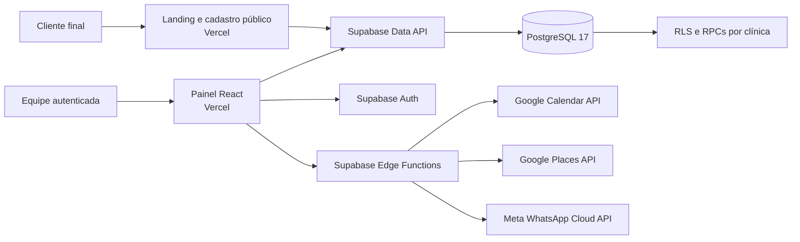

# Arquitetura do Sistema

Atualizado em: 2026-08-11.

## Visão geral

A aplicação de produção é uma SPA React hospedada na Vercel. O navegador usa Supabase Auth e a Data API com uma publishable key; PostgreSQL, RLS, RPCs e Edge Functions formam o backend. Integrações externas ficam nas Edge Functions e nunca recebem secrets pelo bundle Vite.


```mermaid
flowchart LR
  PUBLICO[Cliente final] --> SITE[Landing e cadastro público\nVercel]
  EQUIPE[Equipe autenticada] --> SPA[Painel React\nVercel]
  SITE --> DATA[Supabase Data API]
  SPA --> AUTH[Supabase Auth]
  SPA --> DATA
  DATA --> DB[(PostgreSQL 17)]
  DB --> RLS[RLS e RPCs por clínica]
  SPA --> EDGE[Supabase Edge Functions]
  EDGE --> GCAL[Google Calendar API]
  EDGE --> PLACES[Google Places API]
  EDGE --> META[Meta WhatsApp Cloud API]
```

## Tecnologias e versões

As versões abaixo vêm de `app/package.json` e do projeto remoto em 2026-08-11.

| Camada | Tecnologia | Versão/faixa |
| --- | --- | --- |
| Interface | React / React DOM | `19.2.7` |
| Linguagem | TypeScript | `~6.0.2` |
| Build/dev server | Vite | `8.1.1` |
| Rotas | React Router DOM | `7.18.1` |
| Estado assíncrono/cache | TanStack React Query | `5.101.2` |
| Formulários | React Hook Form | `7.80.0` |
| Validação | Zod | `4.4.3` |
| Datas | date-fns | `4.4.0` |
| Ícones | lucide-react | `1.23.0` |
| Cliente backend | `@supabase/supabase-js` | `2.110.0` |
| Lint | Oxlint | `1.71.0` |
| Banco | PostgreSQL | `17.6.1.127` |
| Backend gerenciado | Supabase | Auth, PostgREST, RLS, RPC, Edge Functions, Vault |
| Runtime serverless | Deno/Supabase Edge Runtime | Gerenciado pelo Supabase |
| Hospedagem web | Vercel | SPA estática em `app/dist` |
| Integração agenda | Google Calendar API | OAuth 2.0 + webhooks |
| Avaliações | Google Places API (New) | Edge Function pública |
| Mensagens | Meta WhatsApp Cloud API | Graph configurável; implantação atual usa `v23.0` por padrão |

O `package-lock.json` deve ser commitado e a Vercel usa `npm ci` para builds reproduzíveis.

## Estrutura do repositório

```text
/
├── app/                         SPA React
│   └── src/                     componentes, contextos, páginas e clientes de integração
├── supabase/                    única fonte de migrations e Edge Functions
├── doc/                         documentação técnica e operacional
├── vercel.json                  comandos de build e rewrite da SPA
└── README.md                    visão rápida do projeto
```

Desde 2026-08-13, não há fontes Supabase duplicadas. `supabase/functions/whatsapp-messages` corresponde à versão simplificada implantada, com fila e processamento periódico. A implementação experimental anterior foi removida para evitar redeploy acidental.

## Frontend

Rotas públicas:

- `/`: landing page, serviços, avaliações do Google e links da clínica;
- `/cadastro-cliente`: cadastro público e interesses em serviços;
- `/login`: login Supabase Auth.

Rotas protegidas:

- `/dashboard`;
- `/clientes`, `/servicos`, `/agenda`, `/agenda/fila-espera`;
- `/equipamentos`, `/planos-tratamento`;
- `/financeiro/fluxo-caixa`, `/financeiro/contas-a-receber`, `/financeiro/contas-a-pagar`;
- `/estoque/itens`, `/estoque/fornecedores`;
- `/mensagens`, `/marketing/campanhas`, `/marketing/disparos`, `/marketing/satisfacao`;
- `/configuracoes/parametros`, `/configuracoes/usuarios`.

`AuthContext` mantém a sessão. `ClinicContext` carrega perfil, vínculos e clínica ativa. Usuários autenticados sem perfil/vínculo recebem uma tela de bloqueio, não o painel.

## Backend e autorização

O frontend é inicializado somente com:

```text
VITE_SUPABASE_URL
VITE_SUPABASE_PUBLISHABLE_KEY
VITE_APP_ENV
```

A publishable key identifica a aplicação, não o usuário. Depois do login, o JWT pessoal determina o papel Postgres `authenticated`; as policies RLS e `usuarios_clinicas` limitam a clínica e as permissões.

Operações multi-registro usam RPCs transacionais, como salvar agendamento, serviço/preço, campanha/destinatários e confirmar fila de espera. Edge Functions usam secret/service role somente no servidor.

## Fluxos principais

### Login

1. O usuário entra por e-mail/senha no Supabase Auth.
2. A SPA recupera a sessão persistida.
3. Carrega `perfis` e `usuarios_clinicas`.
4. Define a clínica ativa e libera rotas protegidas.
5. Consultas e mutações são filtradas por RLS.

### Cadastro público

1. A página pública consulta serviços liberados pela RPC pública.
2. O cliente informa dados e interesses.
3. A RPC de cadastro cria/atualiza o registro sem expor tabelas administrativas.
4. Consentimento de marketing e WhatsApp não deve nascer pré-marcados.

### Agenda e Google Calendar

1. A SPA salva o agendamento por RPC.
2. Solicita sincronização à `google-calendar-sync`.
3. A função cria/atualiza/cancela o evento Google e grava IDs/estado de sync.
4. Eventos externos do Google tornam-se `bloqueios_agenda`.
5. Webhooks e sync token trazem alterações de volta.

### WhatsApp

1. O cliente precisa ter `whatsapp_opt_in_status='aceito'`.
2. Modelos/regras automáticos usam `canal_padrao='whatsapp_business'`.
3. A Edge Function avalia agendamentos e cria itens idempotentes em `fila_mensagens`.
4. RPC com `FOR UPDATE SKIP LOCKED` reserva lotes.
5. A Meta recebe o template aprovado e o resultado vai para fila/logs.
6. O Supabase Cron aciona o processamento a cada cinco minutos usando `pg_net` e Secrets do Vault.
